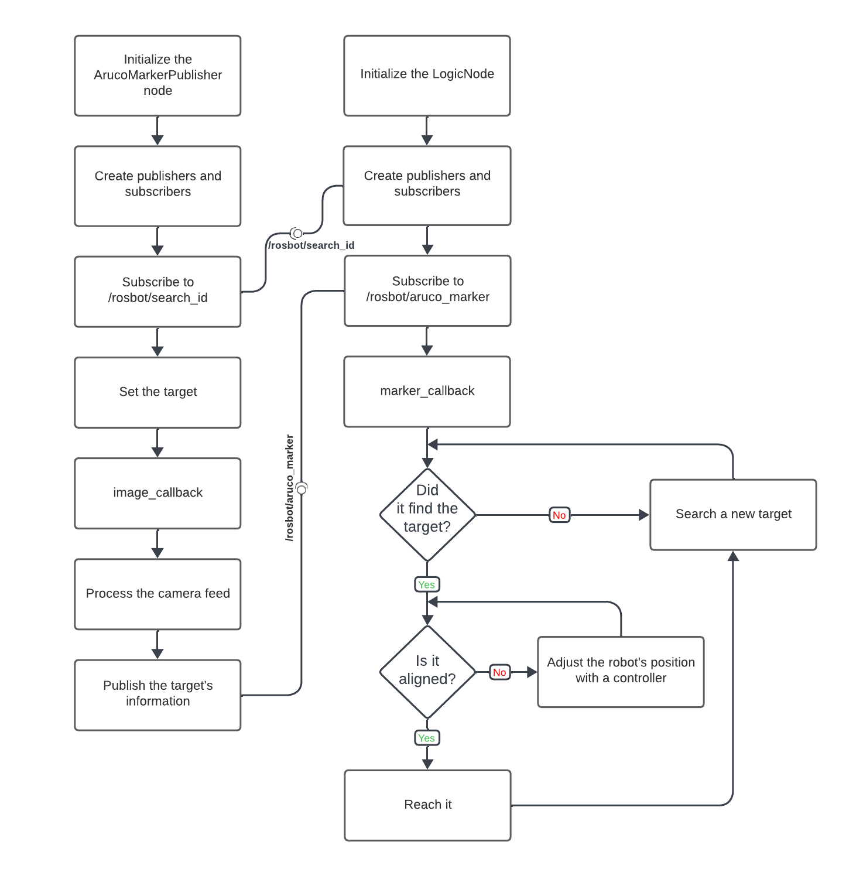

Experimental Robotics Laboratory - First Assignment
======================================
Aruco Marker Robot Navigation
======================================

Project Description
-------------------------

This project involves controlling a robot's movement based on the detection and interaction with Aruco markers in its environment. The robot navigates through a predefined sequence of markers until it reaches a designated target marker.

talk about rosbot_ros package...

environment(gazebo, rviz, ...) ...

Create and setup a Catkin Workspace
--------------------------------

A catkin (ROS) workspace is a directory in which you can create or modify existing catkin packages. We will label our catkin workspace `catkin_ws`. To create the catkin workspace, type the following commands in the Terminal:

```bash
mkdir catkin_ws
cd catkin_ws
mkdir src
catkin_make
```

This will allow us to create a new folder in the home directory called `catkin_ws` by using the `mkdir` command. Then we create a source `src` folder inside the catkin workspace folder. Once done, make sure to use the command `catkin_make` inside the `catkin_ws` folder in order to init the catkin workspace. If you view your current directory contents, you should now have the `devel` and `build` folders. Inside the `devel` folder there are now several `setup.*sh` files. 

Then, we will need to source the `setup.bash` file to overlay this workspace on top of our ROS environment. In order to do this, it is necessary to go back in your home directory with the `cd` command and then type:

```bash
source ~/catkin_ws/devel/setup.bash
```

Remember to add this source command to your `.bashrc` file under the source line of the global ROS installation. This is important so as to use your code with ROS functionalities. In order to access the `.bashrc` file type the following command:

```bash
gedit ~/.bashrc
```

How to run the simulation
-------------------------

Move inside the package and clone our repository and a mandatory one (note that we are using ROS Noetic distro) by typing the command:

```bash
git clone https://github.com/husarion/rosbot_ros.git -b noetic
git clone https://github.com/MickyMori/Lab_assignment_1.git
```

Then, since inside the source folder there is new content, you need to type the command `catkin_make` inside the ROS workspace folder:

```bash
cd
cd catkin_ws
catkin_make
```

Open a new tab in the terminal and run the whole project by running the launch file:

```bash
roslaunch lab_assignment world.launch
```

Software Architecture 
-----------------------

Logic Node (Logic_node.cpp)
* Controls the robot's movement based on marker detection.
* Subscribes to Aruco marker messages.
* Publishes velocity commands and marker IDs for searching.

Aruco Marker Publisher Node (CV_node.cpp)
* Detects Aruco markers in the camera feed.
* Publishes marker information for the Logic Node to control robot movement.

Flowchart
-----------------------



Logic_node.cpp

```
Logic Class:
    - Initialize ROS node, publishers, and subscribers.
    - Define marker IDs and necessary variables.
    - Implement marker_callback for marker detection.
    - Implement controller function for orientation correction.
    - Implement move_rosbot function for robot movement.

marker_callback(msg):
    - Use controller to correct robot position based on marker info.
    - Check if target marker is found or needs searching.
    - Move the robot accordingly:
        - If target found, proceed to the next marker.
        - Adjust alignment or rotation if required.
        - Search for a new marker if not found.

controller(msg):
    - Calculate error based on marker position.
    - Adjust angular velocity for orientation correction.

move_rosbot(lin_x, ang_z):
    - Publish linear and angular velocities to control robot movement.

Main:
    - Initialize ROS node.
    - Create an instance of the Logic class.
    - Enter the ROS spin loop.
```

CV_node.cpp

```
ArucoMarkerPublisher Class:
    - Initialize ArUco marker detector, ROS node, subscribers, and publishers.
    - Implement image_callback for processing camera feed and marker detection.
    - Implement search_callback for receiving the target marker ID.

image_callback(msg):
    - Receive and process the camera feed.
    - Detect Aruco markers in the image.
    - Publish marker information for the Logic Node.

search_callback(target_msg):
    - Receive the desired target marker ID for searching.

Main:
    - Initialize ROS node.
    - Create an instance of the ArucoMarkerPublisher class.
    - Enter the ROS spin loop.
```

Simulation
-----------------------

video of the simulation...

behaviour explanation...

Implementation on the Real Robot
-----------------------

video ...

how to connect ...

Code Documentation
-----------------------

add generated docs link...

Possible Improvements
-----------------------

* Implement a more sophisticated navigation algorithm for smoother movement between markers.
* Enhance error handling and recovery mechanisms for better resilience in marker detection scenarios.


