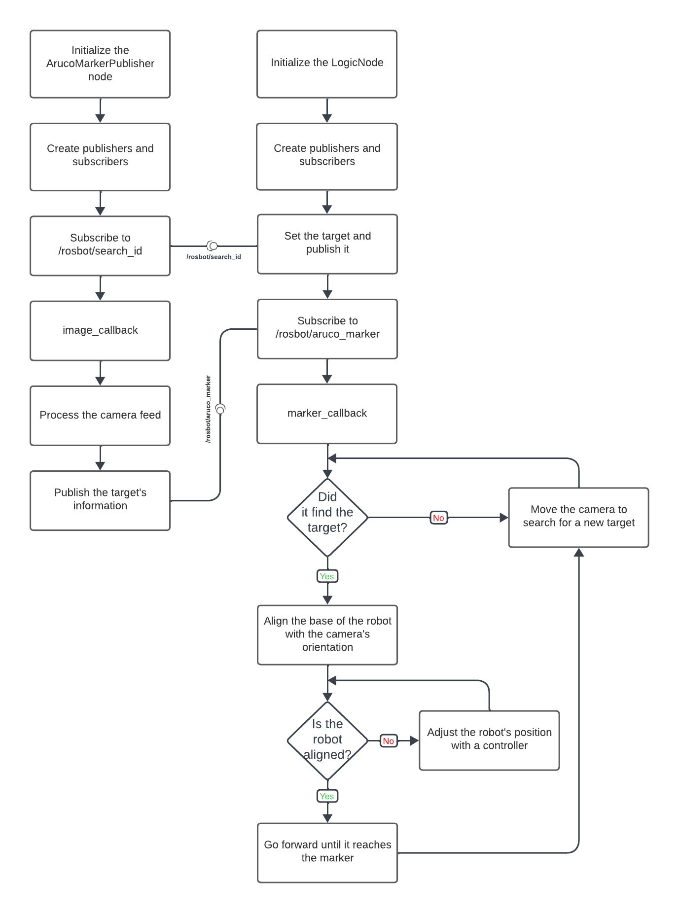

Experimental Robotics Laboratory - First Assignment
======================================

Project Description
-------------------------

The main objective of the project is controlling a robot's movement based on the detection of Aruco markers. Aruco markers are visual markers used in robotics. The program employs a proportional controller to adjust the robot's orientation based on the marker's position. The robot sequentially tracks a predefined set of Aruco markers, aligns its center with each marker, and moves forward when the alignment is achieved. 

explain what the project is about...

talk about rosbot_ros package...

objectives of the project...

How to run the simulation
-------------------------

Move inside the package and clone our repository and a mandatory one (note that we are using ROS Noetic distro) by typing the command:

```bash
git clone https://github.com/husarion/rosbot_ros.git -b noetic
git clone https://github.com/MickyMori/Lab_assignment_1.git
```

Then, since inside the source folder there is new content, you need to type the command `catkin_make` inside the ROS workspace folder:

```bash
cd
cd <your_workspace>
catkin_make
```

Open a new tab in the terminal and run the whole project by running the launch file:

```bash
roslaunch lab_assignment world.launch
```
Software Architecture 
-----------------------

imaage ...

explain the software architecture used ...

Flowchart
-----------------------



Pseudocode
-----------------------

Logic_node.cpp

```
Logic Class:
    - Initialize ROS node, publishers, and subscribers.
    - Define marker IDs and necessary variables.
    - Implement marker_callback for marker detection.
    - Implement controller function for orientation correction.
    - Implement move_rosbot function for robot movement.

marker_callback(msg):
    - Use controller to correct robot position based on marker info.
    - Check if target marker is found or needs searching.
    - Move the robot accordingly:
        - If target found, proceed to the next marker.
        - Adjust alignment or rotation if required.
        - Search for a new marker if not found.

controller(msg):
    - Calculate error based on marker position.
    - Adjust angular velocity for orientation correction.

move_rosbot(lin_x, ang_z):
    - Publish linear and angular velocities to control robot movement.

Main:
    - Initialize ROS node.
    - Create an instance of the Logic class.
    - Enter the ROS spin loop.
```

CV_node.cpp

```
ArucoMarkerPublisher Class:
    - Initialize ArUco marker detector, ROS node, subscribers, and publishers.
    - Implement image_callback for processing camera feed and marker detection.
    - Implement search_callback for receiving the target marker ID.

image_callback(msg):
    - Receive and process the camera feed.
    - Detect Aruco markers in the image.
    - Publish marker information for the Logic Node.

search_callback(target_msg):
    - Receive the desired target marker ID for searching.

Main:
    - Initialize ROS node.
    - Create an instance of the ArucoMarkerPublisher class.
    - Enter the ROS spin loop.
```

Simulation
-----------------------

video of the simulation...

environment used...

behaviour explanation...

Code Documentation
-----------------------

add generated docs link...

Possible Improvements
-----------------------
