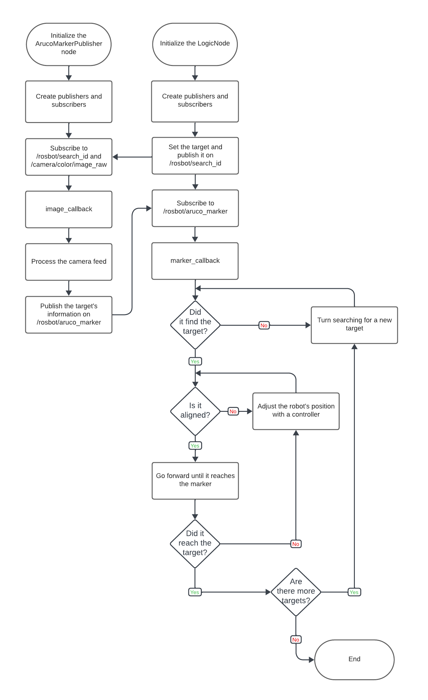

Experimental Robotics Laboratory 🤖
======================================
Aruco Marker Robot Navigation
======================================

Project Description 📎
-------------------------

This project involves controlling a robot's movement based on the detection and interaction with Aruco markers in its environment. The robot navigates through a predefined sequence of markers until it reaches the end. The implementation is done in `ROS Noetic`, both in simulation using the Gazebo environment and with an implementation on the real robot ([ROSbot](https://husarion.com/manuals/rosbot/)).

The IDs of the markers have specific meanings:

* Marker 11 instructs the robot to rotate until it locates marker 12, then reaches it;
* Marker 12 instructs the robot to rotate until it finds marker 13, then reaches it;
* Marker 13 instructs the robot to rotate until it finds marker 15, then reaches it;
* Once marker 15 is found, the robot stops as it has completed its tasks.

Notice that 'reach marker xxx' means that one side of the xxx marker must be greater than a certain pixel threshold in the camera frame.

`Note:` The README for the `rotating_camera` branch contains details about a slightly different implementation for the project. However, it's important to note that the actual implementation on the real robot can only be achieved using a fixed camera.

Team Members 👨‍🔬
-------------

|    |Name |Surname |ID |
|----|---|---|---|
| 1 | Michele | Moriconi | S4861803 |
| 2 | Giovanni | Rocca | S4802954 |
| 3 | Matteo | Cappellini | S4822622 |
| 4 | Manuel | Delucchi | S4803977 |
| 5 | Andrea | Bolla | S4482930 |

Create and setup a Catkin Workspace 🧰
--------------------------------

A catkin (ROS) workspace is a directory in which you can create or modify existing catkin packages. We will label our catkin workspace `catkin_ws`. To create the catkin workspace, type the following commands in the Terminal:

```bash
mkdir catkin_ws
cd catkin_ws
mkdir src
catkin_make
```

This will allow us to create a new folder in the home directory called `catkin_ws` by using the `mkdir` command. Then we create a source `src` folder inside the catkin workspace folder. Once done, make sure to use the command `catkin_make` inside the `catkin_ws` folder in order to init the catkin workspace. If you view your current directory contents, you should now have the `devel` and `build` folders. Inside the `devel` folder there are now several `setup.*sh` files. 

Then, we will need to source the `setup.bash` file to overlay this workspace on top of our ROS environment. In order to do this, it is necessary to go back in your home directory with the `cd` command and then type:

```bash
source ~/catkin_ws/devel/setup.bash
```

Remember to add this source command to your `.bashrc` file under the source line of the global ROS installation. This is important so as to use your code with ROS functionalities. In order to access the `.bashrc` file type the following command:

```bash
gedit ~/.bashrc
```

How to run the simulation ⌨️
-------------------------

Move inside the package and clone our repository and the one containing the markers models by typing the commands:

```bash
git clone https://github.com/CarmineD8/aruco_ros.git
git clone https://github.com/MickyMori/Lab_assignment_1.git
```

At first, to utilize the marker textures, copy the `models` folder from the `aruco_ros` package into `/root/.gazebo/models` directory (all new models should be put here, to let the camera work properly).

Then, since inside the source folder there is new content, you need to type the command `catkin_make` inside the ROS workspace folder:

```bash
cd
cd catkin_ws
catkin_make
```

Finally, run the whole project by running the launch file:

```bash
roslaunch lab_assignment world.launch
```

Flowchart 🎞️
-----------------------

`Logic Node` (Logic_node.cpp)
* Subscribes to Aruco marker messages.
* Controls the robot's movement based on marker detection.
* Publishes velocity commands and marker IDs for searching.

`Aruco Marker Publisher Node` (CV_node.cpp)
* Subscribes to target and camera feed messages.
* Detects Aruco markers by processing them.
* Publishes marker information for the Logic Node to control robot movement.



Node Graph 🔖
-----------------------


Simulation 💻
-----------------------

Here is the simulated behaviour of the robot, sped up to present a better flow of the video.

https://github.com/MickyMori/Lab_assignment_1/assets/104144305/29c77bec-d354-4027-9b30-6a5baf27b63d

Implementation on the Real Robot 🚗
-----------------------

You can explore the live implementation on the **ROSbot 2** real robot by following this guide to connect and upload the program directly onto the robot. Here's the link -> [ROSbot 2 - quick start](https://husarion.com/tutorials/howtostart/rosbot---quick-start/)

https://github.com/MickyMori/Lab_assignment_1/assets/97695681/a7ebad9f-b36e-41ab-a47f-61f6880f1ad1

Possible Improvements 🏷️
-----------------------

* Implement a more sophisticated navigation algorithm for smoother movement between markers.
* Enhance error handling and recovery mechanisms for better resilience in marker detection scenarios, since the robot can struggle with the marker recognition.


